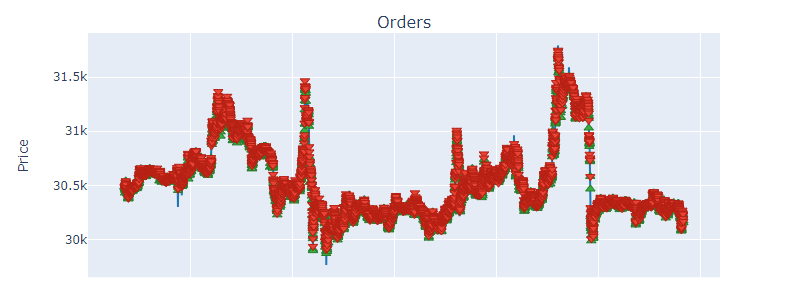
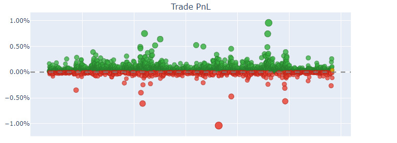
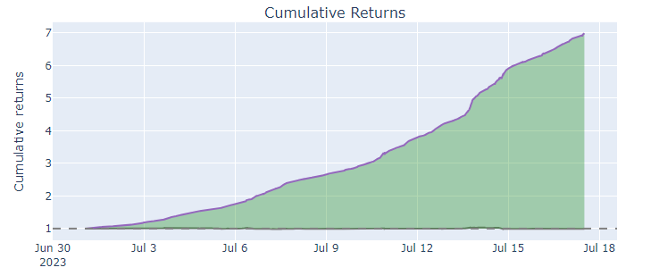
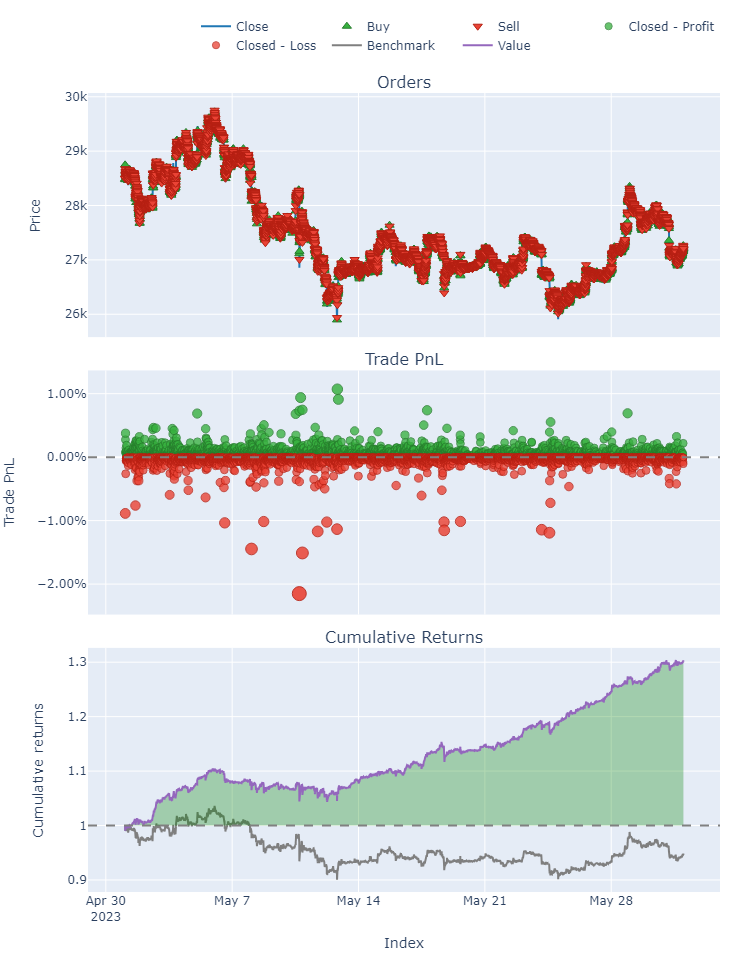

# Random-Forest-Classifier_CryptoTrading
The project applies the Random Forest Classifier in predicting the rise or fall of cryptocurrency prices and backtesting the strategy.

## Requirements
To run this project, you first need to set up your environment and install all required packages. The packages and their specific versions that are required for this project are listed in the requirements.txt file.
```
pip install -r requirements.txt
```
## First use
#### Set the API KEY
The first step to use this tool is to generate an API key on the Binance platform. You can create this key in the API settings tab. To gather exchange data from Binance, you don't need the trading options enabled. After you have created the API key and secret key, copy them into your .env file.
```
API_KEY = 'YOUR_API_KEY'
SECRET_KEY = 'YOUR_SECRET_KEY'
```
#### Set cryptocurrency pair and download data
The next step is to fetch data from Binance using the saving_csv.py script. In the script, set the cryptocurrency pair you want to fetch, the period, and the interval. After setting these up, run the script. This will fetch the data from Binance and save it into a data_set.csv file.

```
symbol = 'BTCUSDT'
interval = Client.KLINE_INTERVAL_1MINUTE
start_time = '2023-07-01 00:00:00'
end_time = '2023-08-01 00:00:00'
```
```
python saving_csv.py
```
#### Train model
Once you have fetched the data, you can run the random_forest.py script. This script will use the data stored in the data_set.csv file to train and save a Random Forest Classifier model.  
Of course, you can set the parameters for the Random Forest Classifier in the code:
```
model  = RandomForestClassifier(n_estimators=100,max_depth=None,min_samples_split=10,min_samples_leaf=20,verbose=1,warm_start=True,n_jobs=-1,random_state=42,min_impurity_decrease=0,criterion="entropy")
```
You can find information on what parameters you can adjust and how to do it in the Scikit-learn library documentation.  
#### Backtest
Now you have a trained model for predicting whether the price will rise or fall. You can now backtest your strategy using the backtest_vbt.py script. I will show you how to do this using the data you've already fetched (I don't recommend doing this as it will introduce false accuracy to the algorithm).  
After running the backtest_vbt.py script, you will receive the following output in your terminal:
```
Start                         2023-07-01 01:41:00
End                           2023-07-17 12:04:00
Period                                      23662
Start Value                                 100.0
End Value                              698.562073
Total Return [%]                       598.562073
Benchmark Return [%]                    -1.104438
Max Gross Exposure [%]                      100.0
Total Fees Paid                               0.0
Max Drawdown [%]                         1.403663
Max Drawdown Duration                        84.0
Total Trades                                 6360
Total Closed Trades                          6359
Total Open Trades                               1
Open Trade PnL                           0.261658
Win Rate [%]                             87.51376
Best Trade [%]                           0.955599
Worst Trade [%]                         -1.036792
Avg Winning Trade [%]                    0.039014
Avg Losing Trade [%]                    -0.028649
Avg Winning Trade Duration               1.755615
Avg Losing Trade Duration                2.246835
Profit Factor                            8.884438
Expectancy                               0.094027
dtype: object
```
As you may have noticed, the profit from the transactions reached a staggering 600%. But does this mean we have found a surefire way to wealth? Probably not - but I'll explain why later ;) 
#### Analisys
The 'orders' chart represents the buy and sell orders of the cryptocurrency. Of course, you can zoom in and out of the chart, a feature provided by the Plotly library.  
<p align="center">
  
</p>


The second chart, 'PnL', represents the Profit and Loss chart. The green circles represent successful trades, while the red ones represent unsuccessful trades. By analyzing this chart, you can check in which time intervals or situations your model did not perform well.  
<p align="center">
  
</p>

In the image below, you can see a huge return from transactions of around 600%, but this is not true! Simply put, the model we trained on the data from the period of July 1st, 2023 - July 17th, 2023 should not be tested on the same period. If we train the model on this period, we should choose a different time range for backtesting. I will discuss this in the next section.
<p align="center">
  
</p>

## Real-world script usage
As you might have guessed, it's unlikely for a strategy to generate a 600% return in just over two weeks. This is because we used the same data to train the Random Forest Classifier model and to backtest the strategy - remember, you should NEVER DO THIS! This artificially generates hope that you have the perfect script.  
So, how should we use this project? I'll describe this in points:  
#### 1. Fetch data for model training.   
For example, I will do this for April 2023.
```
symbol = 'BTCUSDT'
interval = Client.KLINE_INTERVAL_1MINUTE
start_time = '2023-04-01 00:00:00'
end_time = '2023-05-01 00:00:00'
```
```
python saving_csv.py
```
#### 2. Train your model on downloaded data.
```
python random_forest.py
```
#### 3. Fetch data for backtest.
For example: May 2023
```
symbol = 'BTCUSDT'
interval = Client.KLINE_INTERVAL_1MINUTE
start_time = '2023-05-01 00:00:00'
end_time = '2023-06-01 00:00:00'
```
#### 4. Run backtest_vbt.py and check results.
```
python backtest_vbt.py
```
We receive the following response:
```
Start                         2023-05-01 01:41:00
End                           2023-05-31 23:59:00
Period                                      44536
Start Value                                 100.0
End Value                              130.102382
Total Return [%]                        30.102382
Benchmark Return [%]                    -5.348391
Max Gross Exposure [%]                      100.0
Total Fees Paid                               0.0
Max Drawdown [%]                         5.539904
Max Drawdown Duration                     13929.0
Total Trades                                 8302
Total Closed Trades                          8302
Total Open Trades                               0
Open Trade PnL                                0.0
Win Rate [%]                            46.217779
Best Trade [%]                           1.070766
Worst Trade [%]                         -2.150147
Avg Winning Trade [%]                    0.052156
Avg Losing Trade [%]                    -0.041616
Avg Winning Trade Duration               2.776909
Avg Losing Trade Duration                2.166747
Profit Factor                             1.15544
Expectancy                               0.001964
dtype: object
```
<p align="center">
  
</p>

So, what have we done: first, we fetched data from April 2023, then we trained the RFC model, fetched the data again but from May 2023, and tested our strategy on it.  
#### 5. Analysis
Let's take a look at the results... hmm.. they are very nice. The return from the strategy is 30%, even though the benchmark return is a loss of 5%. By training the model on April 30th, 2023, and trading according to its signals in May, we would have achieved a profit of around 30%.  
Remember, this could have been a coincidence or randomness. This model was not optimized by me, so before using it on your data, you should optimize the model.

## What's next?
In order for the model to work well, the hyperparameters of the RFC model should be appropriately chosen.  
Hyperparameter optimization in a Random Forest Classifier (RFC) model is the process of finding the most effective parameters to improve the model's performance. Key hyperparameters in an RFC include:  

* n_estimators: The number of trees in the forest.
* max_depth: The maximum depth of each tree.
* min_samples_split: The minimum number of samples required to split an internal node.
* min_samples_leaf: The minimum number of samples required to be at a leaf node.
* max_features: The number of features to consider when looking for the best split.  

To find the optimal values for these hyperparameters, we use techniques like Grid Search, where we train a model for each combination of hyperparameters and choose the set that performs best on the validation data. Remember, this tuning should be done on a separate validation set or with cross-validation to avoid overfitting.

# Disclaimer

Please note that this script is NOT investment advice. I am NOT a financial advisor. The script is provided as-is, and it is primarily an illustration of possibilities. Using this script is at your own risk. Always do your own research and consult with a professional financial advisor before making any investment decisions.


